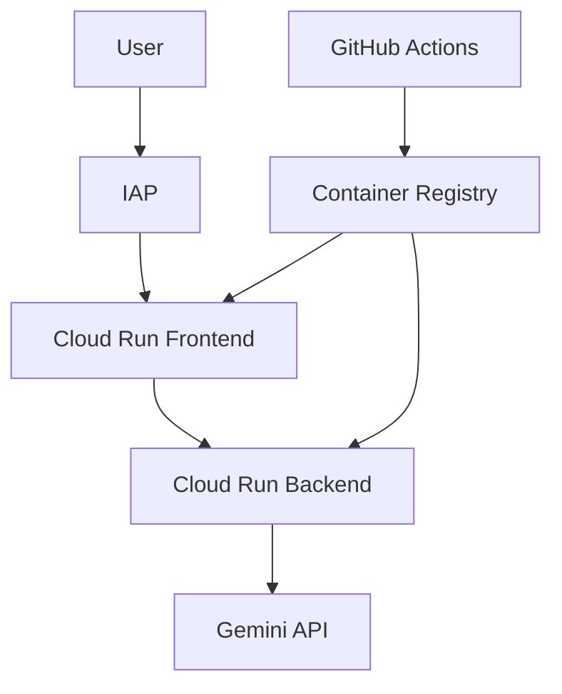

# CBT Assistant POC - Monorepo

This is the monorepo for the CBT Assistant Proof of Concept, combining the re-frame.social frontend and the reframe-agents backend into a unified codebase.

## ✨ Features

- **Text-based interaction**: Type your thoughts and receive gentle reframing suggestions
- **Voice conversation**: Natural audio dialog with the AI assistant (NEW!)
- **Real-time streaming**: Responses stream as they're generated
- **Privacy-focused**: No audio storage, only transcriptions are kept
- **Evidence-based**: Uses cognitive behavioral therapy techniques

## 🏗️ Monorepo Structure

```
re-frame/
├── frontend/            # Next.js 14 frontend application
│   ├── app/            # Next.js App Router
│   ├── components/     # React components
│   ├── lib/            # Core functionality
│   └── package.json    # Frontend dependencies
├── backend/            # FastAPI backend with ADK (to be merged)
│   ├── app/            # FastAPI application
│   ├── agents/         # ADK agents
│   └── requirements.txt # Python dependencies
├── docs/               # Shared documentation
├── scripts/            # Utility scripts
└── docker-compose.yml  # Local development setup
```

## 🚀 Quick Start

### Prerequisites

- Node.js 18+
- pnpm 10.11.0+
- Python 3.11+
- Docker & Docker Compose

### Development Setup

1. **Clone the repository**
   ```bash
   git clone https://github.com/macayaven/re-frame.git
   cd re-frame
   ```

2. **Install dependencies**
   ```bash
   # Install root dependencies
   npm install

   # Install frontend dependencies
   cd frontend && pnpm install && cd ..

   # Install backend dependencies (after merge)
   cd backend && pip install -r requirements.txt && cd ..
   ```

3. **Run development servers**
   ```bash
   # Run frontend only
   npm run dev:frontend

   # Run backend only (after merge)
   npm run dev:backend

   # Run both frontend and backend
   npm run dev:all
   ```

4. **Access the applications**
   - Frontend: http://localhost:3000
   - Backend API: http://localhost:8000
   - API docs: http://localhost:8000/docs

## 📚 Documentation

- [Frontend README](./frontend/README.md) - Detailed frontend documentation
- [Backend README](./backend/README.md) - Backend documentation (coming soon)
- [Team Coordination Guide](./docs/TEAM_COORDINATION_GUIDE.md) - Development workflow
- [Migration Checklist](./docs/MONOREPO_MIGRATION_CHECKLIST.md) - Monorepo setup progress

## 🧪 Testing

```bash
# Run all tests
npm run test:all

# Run frontend tests
npm run test:frontend

# Run backend tests (after merge)
npm run test:backend
```

## 🐳 Docker Development

### Docker Compose Files

This project uses multiple Docker Compose configurations for different environments:

| File | Purpose | Usage |
|------|---------|-------|
| `docker-compose.yml` | Base configuration for local development | `docker-compose up` |
| `docker-compose.override.yml` | Auto-loaded development overrides (CORS settings) | Loaded automatically |
| `docker-compose.dev.yml` | Extended dev with Redis & MailHog | `docker-compose -f docker-compose.yml -f docker-compose.dev.yml up` |
| `docker-compose.prod.yml` | Production testing configuration | `docker-compose -f docker-compose.prod.yml up` |
| `docker-compose.integration.yml` | Integration testing with Playwright | Used by `make test-integration` |
| `tests/e2e/docker-compose.test.yml` | E2E test overrides | Used by E2E test suite |

### Common Docker Commands

```bash
# Basic development (frontend + backend)
docker-compose up --build

# Full development environment (includes Redis, MailHog)
docker-compose -f docker-compose.yml -f docker-compose.dev.yml up

# Run E2E tests
cd tests/e2e && ./run_tests.sh

# Production testing
docker-compose -f docker-compose.prod.yml up

# Stop all services
docker-compose down

# Clean up volumes
docker-compose down -v
```

## 🚢 Deployment

### Overview

The application is deployed to Google Cloud Run with Identity-Aware Proxy (IAP) protection:

- **Frontend**: Next.js application served from Cloud Run
- **Backend**: FastAPI with Google ADK agents on Cloud Run
- **Security**: IAP protects the demo from unauthorized access
- **CI/CD**: GitHub Actions handles automated deployment on tags

### Quick Deployment

1. **Set up GCP infrastructure**:
   ```bash
   ./scripts/setup-gcp-infrastructure.sh
   ```

2. **Configure Workload Identity Federation** (Recommended):
   ```bash
   ./scripts/setup-workload-identity.sh
   ```

3. **Configure GitHub Secrets**:
   - `GCP_PROJECT_ID`: Your GCP project ID
   - `GCP_REGION`: Deployment region (e.g., us-central1)
   - `GCP_BILLING_ACCOUNT_ID`: Your GCP billing account ID
   - `WIF_PROVIDER`: Workload Identity Provider (from setup script)
   - `WIF_SERVICE_ACCOUNT`: Service account email
   - `GEMINI_API_KEY`: Your Gemini API key
   - `IAP_CLIENT_ID`: OAuth client ID for IAP
   - `IAP_CLIENT_SECRET`: OAuth client secret
   - `AUTHORIZED_DOMAIN`: Your organization domain

4. **Deploy**:
   ```bash
   # Create a release tag
   git tag v1.0.0
   git push origin v1.0.0
   ```

### Local Testing with Docker

```bash
# Test with production configuration
docker-compose -f docker-compose.prod.yml up

# Access at:
# - Frontend: http://localhost:8080
# - Backend: http://localhost:8000
```

### Manual Deployment

```bash
# Build and push images
docker build -t ghcr.io/your-org/re-frame-backend:latest ./backend
docker build -f ./frontend/Dockerfile.standalone \
  -t ghcr.io/your-org/re-frame-frontend:latest ./frontend

# Push to registry
docker push ghcr.io/your-org/re-frame-backend:latest
docker push ghcr.io/your-org/re-frame-frontend:latest

# Deploy to Cloud Run
gcloud run deploy re-frame-backend \
  --image ghcr.io/your-org/re-frame-backend:latest \
  --region us-central1

gcloud run deploy re-frame-frontend \
  --image ghcr.io/your-org/re-frame-frontend:latest \
  --region us-central1
```

### IAP Configuration

See [docs/IAP_CONFIGURATION.md](docs/IAP_CONFIGURATION.md) for detailed IAP setup instructions.

### Deployment Architecture



## 🤝 Contributing

1. Create a feature branch from `main`
2. Make your changes following our coding standards
3. Write/update tests as needed
4. Submit a PR with a clear description
5. Ensure all CI checks pass

## 📋 Project Management

- **Project Board**: [GitHub Projects](https://github.com/users/macayaven/projects/7)
- **Issues**: [GitHub Issues](https://github.com/macayaven/re-frame/issues)
- **Discussions**: [GitHub Discussions](https://github.com/macayaven/re-frame/discussions)

## 🔐 Security

- No audio data is stored
- All data transmission is encrypted
- Regular security updates via Dependabot
- CSP headers configured for production

## 📄 License

This project is proprietary. All rights reserved.

---

**Note**: This is an active monorepo migration. The backend code will be merged via git subtree from the reframe-agents repository.