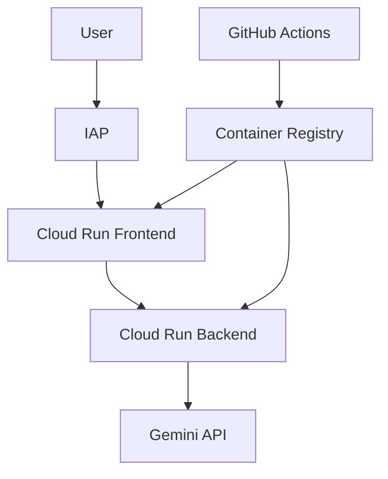

# CBT Assistant POC - Monorepo

A transparent, AI-assisted cognitive behavioral therapy (CBT) tool designed for people with Avoidant Personality Disorder (AvPD) and social anxiety. This monorepo combines the re-frame.social frontend and the reframe-agents backend into a unified codebase.

## ✨ Features

- **Text-based interaction**: Type your thoughts and receive gentle reframing suggestions
- **Voice conversation**: Natural audio dialog with the AI assistant (Optional)
- **Real-time streaming**: Responses stream as they're generated via Server-Sent Events
- **Privacy-focused**: No audio storage, only transcriptions are kept
- **Evidence-based**: Uses cognitive behavioral therapy techniques
- **Multi-phase conversation**: Structured flow through greeting, discovery, reframing, and summary
- **Safety first**: Crisis detection at every user input

## 🛠️ Tech Stack

### Frontend
- **Framework**: Next.js 14 (App Router)
- **Language**: TypeScript with strict mode
- **Styling**: Tailwind CSS v3
- **Audio**: Web Audio API with AudioWorklets
- **Real-time**: Server-Sent Events (SSE)
- **Testing**: Jest + React Testing Library + Playwright
- **API Client**: Generated from OpenAPI schema

### Backend
- **Framework**: FastAPI
- **Language**: Python 3.12
- **AI**: Google ADK with Gemini 2.0 Flash
- **Package Manager**: uv (NOT pip or poetry)
- **Testing**: pytest with 80% coverage requirement
- **Code Quality**: black, isort, ruff, mypy
- **Voice** (optional): Google Cloud Speech & TTS

## 🏗️ Monorepo Structure

```
re-frame/
├── frontend/                # Next.js 14 frontend application
│   ├── app/                # Next.js App Router pages
│   ├── components/         # React components with tests
│   ├── lib/                # Core functionality (SSE, audio, API)
│   ├── public/worklets/    # Web Audio worklets
│   └── CLAUDE.md          # Frontend-specific AI assistant guidance
├── backend/                # FastAPI backend with Google ADK
│   ├── src/               # Source code (NOT app/)
│   │   ├── agents/        # ADK Sequential Agents
│   │   ├── knowledge/     # CBT context and techniques
│   │   ├── services/      # Session management, language detection
│   │   └── main.py        # FastAPI app entry point
│   ├── tests/             # Comprehensive test suite
│   └── CLAUDE.md          # Backend-specific AI assistant guidance
├── tests/                  # Integration and E2E tests
│   ├── e2e/               # Python E2E tests with pytest-xdist
│   └── load/              # Load testing (k6, locust)
├── playwright-js/          # JavaScript Playwright tests
│   └── tests/             # Voice modality E2E tests
├── docs/                   # Project documentation
├── scripts/                # Deployment and utility scripts
├── docker-compose.yml      # Base Docker configuration
├── Makefile               # Development commands
└── CLAUDE.md              # Project-wide AI assistant guidance
```

## 🚀 Quick Start

### Prerequisites

- Node.js 18+
- pnpm 10.11.0+
- Python 3.12 (specifically required)
- uv (Python package manager)
- Docker & Docker Compose
- Gemini API key

### Development Setup

1. **Clone the repository**
   ```bash
   git clone https://github.com/macayaven/re-frame.git
   cd re-frame
   ```

2. **Quick setup with Make**
   ```bash
   make setup  # Installs pnpm, uv, and all dependencies
   ```

   Or manually:
   ```bash
   # Install package managers
   npm install -g pnpm
   curl -LsSf https://astral.sh/uv/install.sh | sh

   # Install dependencies
   cd frontend && pnpm install && cd ..
   cd backend && uv sync --all-extras && cd ..
   ```

3. **Set up environment variables**
   ```bash
   # Backend (.env)
   GEMINI_API_KEY=your-gemini-api-key
   ```

4. **Run development servers**
   ```bash
   # Using npm scripts
   npm run dev:frontend    # Frontend only (http://localhost:3000)
   npm run dev:backend     # Backend only (http://localhost:8000)
   npm run dev:all         # Both concurrently

   # Or using Make
   make dev-frontend
   make dev-backend
   make dev  # Full Docker development environment
   ```

5. **Access the applications**
   - Frontend: http://localhost:3000
   - Backend API: http://localhost:8000
   - API docs: http://localhost:8000/docs

## 📚 Documentation

- [Frontend README](./frontend/README.md) - Detailed frontend documentation
- [Backend README](./backend/README.md) - Backend documentation
- [Team Coordination Guide](./docs/TEAM_COORDINATION_GUIDE.md) - Development workflow
- [CLAUDE.md Files](./CLAUDE.md) - AI assistant context and guidance
- [Linear Project](https://linear.app/carlos-crespo/project/re-framesocial-cbt-assistant-6c36f6288cc8) - Primary project tracking

## ✅ Quality Checks

**IMPORTANT**: Always run checks before pushing:

```bash
# Frontend
cd frontend && pnpm run lint && pnpm run typecheck && pnpm run test

# Backend
cd backend && uv run poe check  # Runs format-check, lint, typecheck, and tests

# Or use Make
make pre-commit  # Runs all checks
```

## 🧪 Testing

```bash
# Run all tests
npm run test:all
make test  # Alternative using Makefile

# Frontend tests
cd frontend && pnpm test        # Unit tests
cd frontend && pnpm test:e2e    # E2E tests with Playwright

# Backend tests
cd backend && uv run poe test   # All tests with coverage
cd backend && uv run pytest -n auto  # Parallel execution with pytest-xdist

# E2E tests
cd tests/e2e && ./run_tests.sh  # Python E2E tests
npm run e2e:js                   # JavaScript Playwright tests

# Voice modality tests (optional)
cd backend && uv run pytest tests/test_voice_*.py
cd playwright-js && npm test tests/voice-network-resilience.spec.js
```

## 🐳 Docker Development

### Docker Compose Files

This project uses multiple Docker Compose configurations for different environments:

| File | Purpose | Usage |
|------|---------|-------|
| `docker-compose.yml` | Base configuration for local development | `docker-compose up` |
| `docker-compose.override.yml` | Auto-loaded development overrides (CORS settings) | Loaded automatically |
| `docker-compose.dev.yml` | Extended dev with Redis & MailHog | `docker-compose -f docker-compose.yml -f docker-compose.dev.yml up` |
| `docker-compose.prod.yml` | Production testing configuration | `docker-compose -f docker-compose.prod.yml up` |
| `docker-compose.integration.yml` | Integration testing with Playwright | Used by `make test-integration` |
| `tests/e2e/docker-compose.test.yml` | E2E test overrides | Used by E2E test suite |

### Common Docker Commands

```bash
# Basic development (frontend + backend)
docker-compose up --build

# Full development environment (includes Redis, MailHog)
docker-compose -f docker-compose.yml -f docker-compose.dev.yml up

# Run E2E tests
cd tests/e2e && ./run_tests.sh

# Production testing
docker-compose -f docker-compose.prod.yml up

# Stop all services
docker-compose down

# Clean up volumes
docker-compose down -v
```

## 🎤 Voice Modality (Optional)

The backend supports voice functionality through Google Cloud services:

### Setup
```bash
# Install voice dependencies
cd backend && uv sync --extra voice

# Required environment variables
GOOGLE_CLOUD_PROJECT=your-project-id
GOOGLE_APPLICATION_CREDENTIALS=path/to/service-account.json
```

### Features
- **Speech-to-Text**: Transcribes user voice input
- **Text-to-Speech**: Generates natural voice responses
- **Real-time streaming**: Low-latency audio processing
- **Multi-language support**: Automatic language detection

### Testing
```bash
# Run voice unit tests
cd backend && uv run pytest tests/test_voice_*.py

# Run voice E2E tests
cd playwright-js && npm test tests/voice-*.spec.js

# Load testing
cd tests/load && k6 run voice-load-test.js
```

## 🚢 Deployment

### Overview

The application is deployed to Google Cloud Run with Identity-Aware Proxy (IAP) protection:

- **Frontend**: Next.js application served from Cloud Run
- **Backend**: FastAPI with Google ADK agents on Cloud Run
- **Security**: IAP protects the demo from unauthorized access
- **CI/CD**: GitHub Actions handles automated deployment on tags

### Quick Deployment

1. **Set up GCP infrastructure**:
   ```bash
   ./scripts/setup-gcp-infrastructure.sh
   ```

2. **Configure Workload Identity Federation** (Recommended):
   ```bash
   ./scripts/setup-workload-identity.sh
   ```

3. **Configure GitHub Secrets**:
   - `GCP_PROJECT_ID`: Your GCP project ID
   - `GCP_REGION`: Deployment region (e.g., us-central1)
   - `GCP_BILLING_ACCOUNT_ID`: Your GCP billing account ID
   - `WIF_PROVIDER`: Workload Identity Provider (from setup script)
   - `WIF_SERVICE_ACCOUNT`: Service account email
   - `GEMINI_API_KEY`: Your Gemini API key
   - `IAP_CLIENT_ID`: OAuth client ID for IAP
   - `IAP_CLIENT_SECRET`: OAuth client secret
   - `AUTHORIZED_DOMAIN`: Your organization domain

4. **Deploy**:
   ```bash
   # Create a release tag
   git tag v1.0.0
   git push origin v1.0.0
   ```

### Local Testing with Docker

```bash
# Test with production configuration
docker-compose -f docker-compose.prod.yml up

# Access at:
# - Frontend: http://localhost:8080
# - Backend: http://localhost:8000
```

### Manual Deployment

```bash
# Build and push images
docker build -t ghcr.io/your-org/re-frame-backend:latest ./backend
docker build -f ./frontend/Dockerfile.standalone \
  -t ghcr.io/your-org/re-frame-frontend:latest ./frontend

# Push to registry
docker push ghcr.io/your-org/re-frame-backend:latest
docker push ghcr.io/your-org/re-frame-frontend:latest

# Deploy to Cloud Run
gcloud run deploy re-frame-backend \
  --image ghcr.io/your-org/re-frame-backend:latest \
  --region us-central1

gcloud run deploy re-frame-frontend \
  --image ghcr.io/your-org/re-frame-frontend:latest \
  --region us-central1
```

### IAP Configuration

See [docs/IAP_CONFIGURATION.md](docs/IAP_CONFIGURATION.md) for detailed IAP setup instructions.

### Deployment Architecture



## 🤝 Contributing

1. Create a feature branch from `main`
2. Make your changes following our coding standards
3. Write/update tests as needed
4. Submit a PR with a clear description
5. Ensure all CI checks pass

## 📋 Project Management

- **Primary Tracking**: [Linear Project](https://linear.app/carlos-crespo/project/re-framesocial-cbt-assistant-6c36f6288cc8)
- **GitHub Board**: [GitHub Projects](https://github.com/users/macayaven/projects/7)
- **Issues**: [GitHub Issues](https://github.com/macayaven/re-frame/issues)
- **Active Issues**:
  - CAR-24: Remove duplicate backend/main.py entry point (Urgent)
  - CAR-25: Migrate to FastAPI lifespan protocol (Urgent)
  - CAR-26: Fix performance monitor task tracking (High)
  - CAR-27: Implement real language detection (High)
  - CAR-28: Add missing test coverage for UI components (Medium)

## 🔐 Security

- No audio data is stored
- All data transmission is encrypted
- Regular security updates via Dependabot
- CSP headers configured for production

## 📄 License

This project is proprietary. All rights reserved.

---

**Status**: Monorepo migration complete. Both frontend and backend are fully integrated.