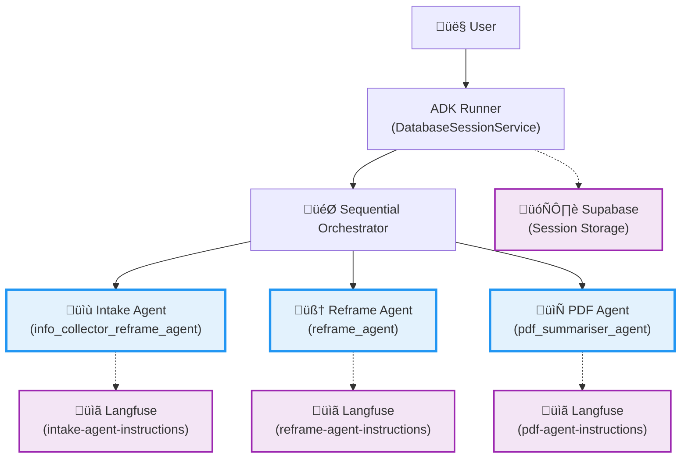

# Minimal POC Specification - Cognitive Reframing Assistant

## üö® CRITICAL: This is the ONLY Valid Specification

**THIS DOCUMENT IS THE SINGLE SOURCE OF TRUTH** for the re-frame POC implementation. 

- ‚úÖ **USE**: This specification (`/Users/carlos/workspace/re-frame/agentic-workflow/docs/MINIMAL_POC_SPECIFICATION.md`)
- ‚úÖ **USE**: The verified test files (`verify_connections.py`, `verify_langfuse_tracing.py`) for implementation examples
- ‚ùå **IGNORE**: All other architecture documents
- ‚ùå **IGNORE**: Any conflicting specifications or designs

**Key Requirements**:
1. **3 agents only**: intake, reframe, synthesis (NO framework agents)
2. **Exact prompt names**: intake-agent-adk-instructions, reframe-agent-adk-instructions, synthesis-agent-adk-instructions, should be taken from Langfuse
3. **Exact env vars**: SUPABASE_REFRAME_DB_CONNECTION_STRING (not SUPABASE_CONNECTION_STRING) should be used for DatabaseSessionService
4. **Mandatory tracing**: Langfuse tracing should be integrated
5. The workflow should be purely adk following the best practices of it: documentation here: https://google.github.io/adk-docs

## Overview

A streamlined 3-agent system that delivers micro-CBT cognitive reframing for users with personality disorder traits. The system follows ADK best practices, uses existing infrastructure (Langfuse, Supabase), and maintains simplicity while providing therapeutic value.

## Core Architecture



## Agent Specifications

### 1. Intake Agent (info_collector_reframe_agent)

**Purpose**: Gather minimal viable data through empathetic conversation

**Data Collection**:
- **Must collect** (all 3 required):
  1. `trigger_situation`: Who/where/when context
  2. `automatic_thought`: Exact negative thought 
  3. `emotion_data`: Emotion label + intensity (0-10)

- **Optional extras** (if volunteered):
  - Duration, frequency
  - One fact for/against
  - 0-100% confidence
  - Perceived impact
  - Cultural notes

**Behavior**:
- Validate feelings FIRST before any question
- One concise question per turn
- Maximum 4 user turns
- Mirror user's exact language
- All questions are optional (user can refuse)

**Safety**:
- Crisis keywords ‚Üí immediate escalation with hotline (024 Spain)
- Emotion jump >2 points ‚Üí acknowledge and offer break

**Completion**:
- Sets `collection_complete = True` when all 3 must-haves collected
- Says: "Thank you for sharing all of this with me. I have a good understanding now."

### 2. Reframe Agent (reframe_agent)

**Purpose**: Apply CBT techniques and engage in therapeutic conversation

**Phase 1 - Analysis** (One-time):
- Identify 1-2 cognitive distortions
- Generate evidence for/against
- Create balanced thought (≤40 words)
- Suggest micro-action (≤10 minutes)
- Request confidence ratings (before/after)

**Phase 2 - Conversational Support** (NEW - Ongoing):
- Present the analysis conversationally
- Allow user to ask clarifying questions
- Explore the reframe deeper if requested
- Validate reactions to the reframe
- Adjust micro-action if needed
- Continue until user is satisfied or explicitly ready to proceed

**Output**: 
- Stores `ReframeAnalysis` in session state
- Maintains warm, collaborative tone
- Sets `reframe_done = True` when user indicates completion

**Safety**:
- Any crisis language ‚Üí escalate immediately
- Monitor for resistance or increased distress

### 3. PDF Summarizer Agent (pdf_summariser_agent)  

**Purpose**: Create anonymized takeaway document

**Inputs**:
- IntakeData (situation, thought, emotion)
- ReframeAnalysis (complete JSON)

**Anonymization**:
- Replace names with "Client"
- Strip dates more specific than month/year
- Remove locations beyond city level

**PDF Structure**:
```
Header: Cognitive Reframing Summary
Date: YYYY-MM-DD

Your Input:
- Situation: [anonymized]
- Thought: [exact]
- Emotion: [label + intensity]

Analysis:
- Distortions Found: [list]
- Evidence Table: [for | against]
- Balanced Perspective: [text]

Action Plan:
- Micro-action: [specific task]
- Confidence Shift: [before]% ‚Üí [after]%

Next Steps:
‚ñ° Complete micro-action today
‚ñ° Notice this thought pattern
‚ñ° Share with therapist

Resources: Crisis line 024 (Spain)
```

**Completion**:
- Generate PDF as base64
- Set `pdf_ready = True`
- Provide download link

## Data Models (Simplified)

```python
# Minimal models matching POC requirements

class IntakeData(BaseModel):
    """Essential data from intake phase"""
    trigger_situation: str | None = None
    automatic_thought: str | None = None  
    emotion_data: str | None = None  # "sad, 8/10"
    
class ReframeAnalysis(BaseModel):
    """CBT analysis output"""
    distortions: list[str]  # Max 2
    evidence_for: list[str]
    evidence_against: list[str]
    balanced_thought: str  # ≤40 words
    micro_action: str  # ≤10 min task
    confidence_before: int  # 0-100
    confidence_after: int | None = None  # 0-100
    
class SessionState(BaseModel):
    """Complete session state"""
    intake_data: IntakeData | None = None
    reframe_analysis: ReframeAnalysis | None = None
    collection_complete: bool = False
    reframe_done: bool = False
    escalate: bool = False
    crisis_detected: bool = False
    pdf_ready: bool = False
```

## Implementation Requirements

### 1. Use ADK Best Practices

```python
# Proper DatabaseSessionService with Supabase
session_service = DatabaseSessionService(
    db_url=os.environ["SUPABASE_REFRAME_DB_CONNECTION_STRING"]
)

# Langfuse prompt management AND tracing
from langfuse import Langfuse, observe

langfuse = Langfuse(
    host=os.environ["LANGFUSE_HOST"],
    public_key=os.environ["LANGFUSE_PUBLIC_KEY"],
    secret_key=os.environ["LANGFUSE_SECRET_KEY"]
)

# Load prompts from Langfuse (EXACT names - these exist and are verified)
intake_prompt = langfuse.get_prompt("intake-agent-adk-instructions")
reframe_prompt = langfuse.get_prompt("reframe-agent-adk-instructions")
pdf_prompt = langfuse.get_prompt("synthesis-agent-adk-instructions")

# Sequential workflow
root_agent = SequentialAgent(
    name="cognitive_reframing_pipeline",
    sub_agents=[
        intake_agent,
        reframe_agent,
        pdf_agent
    ]
)
```

### 2. Langfuse Tracing Requirements

**MANDATORY**: All agent executions MUST be traced using Langfuse for observability.

```python
# Use @observe decorator on all agent methods
@observe(name="intake_agent_run")
async def run_intake_agent(user_input: str) -> IntakeData:
    # Agent logic here
    pass

# Create traces for sessions
trace = langfuse.trace(
    name="cognitive_reframing_session",
    user_id=user_id,
    session_id=session_id,
    metadata={"version": "poc_v1"}
)

# Add spans for each agent
intake_span = trace.span(name="intake_agent")
reframe_span = trace.span(name="reframe_agent")
pdf_span = trace.span(name="pdf_agent")

# Track generations (LLM calls)
generation = span.generation(
    name="extract_trigger",
    model="gemini-2.0-flash",
    input=prompt,
    output=response,
    usage={"input": token_count, "output": output_tokens}
)

# Add scores for quality tracking
trace.score(name="session_complete", value=1.0)
trace.score(name="crisis_detected", value=0.0)
```

**See `/verify_langfuse_tracing.py` for complete examples of all tracing patterns.**

### 3. Environment Variables (Already Available and Verified)

```bash
GOOGLE_API_KEY                          # For Gemini
SUPABASE_REFRAME_DB_CONNECTION_STRING  # For DatabaseSessionService (NOT SUPABASE_CONNECTION_STRING)
LANGFUSE_HOST                          # For prompt management & tracing
LANGFUSE_PUBLIC_KEY        
LANGFUSE_SECRET_KEY        
```

**IMPORTANT**: Use the EXACT environment variable names above. They have been verified to exist.

### 4. Code Quality Requirements

- Type hints on all functions
- Docstrings for all classes/methods
- No unused imports
- Follow Black formatting
- Pass Ruff linting
- Handle errors gracefully
- Log important events

### 5. Safety Features

- Crisis detection in every agent
- Emotion escalation monitoring  
- Clear hotline information (024 Spain)
- Immediate flow interruption on crisis
- Gentle re-engagement after breaks

## User Flow Example

```
User: "I can't do anything right"

Intake: "I hear how heavy that thought feels. What situation brought this up?"

User: "Failed my driving test today"

Intake: "Thank you for sharing that. The thought 'I can't do anything right' - is that what's going through your mind about the test?"

User: "Yes exactly"

Intake: "How would you describe what you're feeling? And on a scale of 0-10?"

User: "Frustrated and ashamed, about 7"

Intake: "Thank you for sharing all of this with me. I have a good understanding now."

[Transition to Reframe Agent]

Reframe: "I can see why failing the driving test while thinking 'I can't do anything right' would feel so frustrating and shameful. 

Looking at this thought, I notice a pattern called 'all-or-nothing thinking' - where one setback feels like complete failure. 

Let's explore this: What evidence supports the thought that you can't do ANYTHING right?"

User: "Well I failed the test"

Reframe: "Yes, the test didn't go as hoped. What about evidence against the thought - things you have done successfully?"

User: "I guess I did pass the written exam, and I've been practicing a lot"

Reframe: "That's important - you passed the written exam and have been putting in effort. A more balanced thought might be: 'I didn't pass this driving test, but I'm learning and have succeeded at other parts of the process.'

For a small action step, what if you spent 10 minutes listing what went well during the test and what to practice next time?"

User: "That makes sense, I could do that"

Reframe: "How confident do you feel in the original thought now, from 0-100%?"

User: "Maybe like 40% now instead of 90%"

Reframe: "That's a significant shift. Is there anything else about this reframe you'd like to explore?"

User: "No, I think I get it now. Ready for the summary"

[Transition to PDF Agent]

PDF: "I'll create your personalized summary now. You'll have a PDF with your reframe and action plan to refer back to."
```

## Success Criteria

1. **Minimal Complexity**: Just 3 agents, simple flow
2. **ADK Compliant**: Uses DatabaseSessionService, proper patterns
3. **Infrastructure Integration**: Langfuse prompts, Supabase storage
4. **Safety First**: Crisis detection, emotion monitoring
5. **User Agency**: All questions optional, conversational reframe
6. **Code Quality**: Passes all linting, typing, formatting checks
7. **PD-Sensitive**: Validation-first, micro-actions, no overwhelm

## What This is NOT

- No multiple framework agents (CBT, DBT, ACT, etc.)
- No complex orchestration or state management
- No custom tools beyond what's needed
- No features beyond the core POC scope
- No complex multi-agent coordination

This specification delivers exactly what the POC describes: a simple, effective micro-intervention for cognitive reframing with appropriate safety measures and user control.