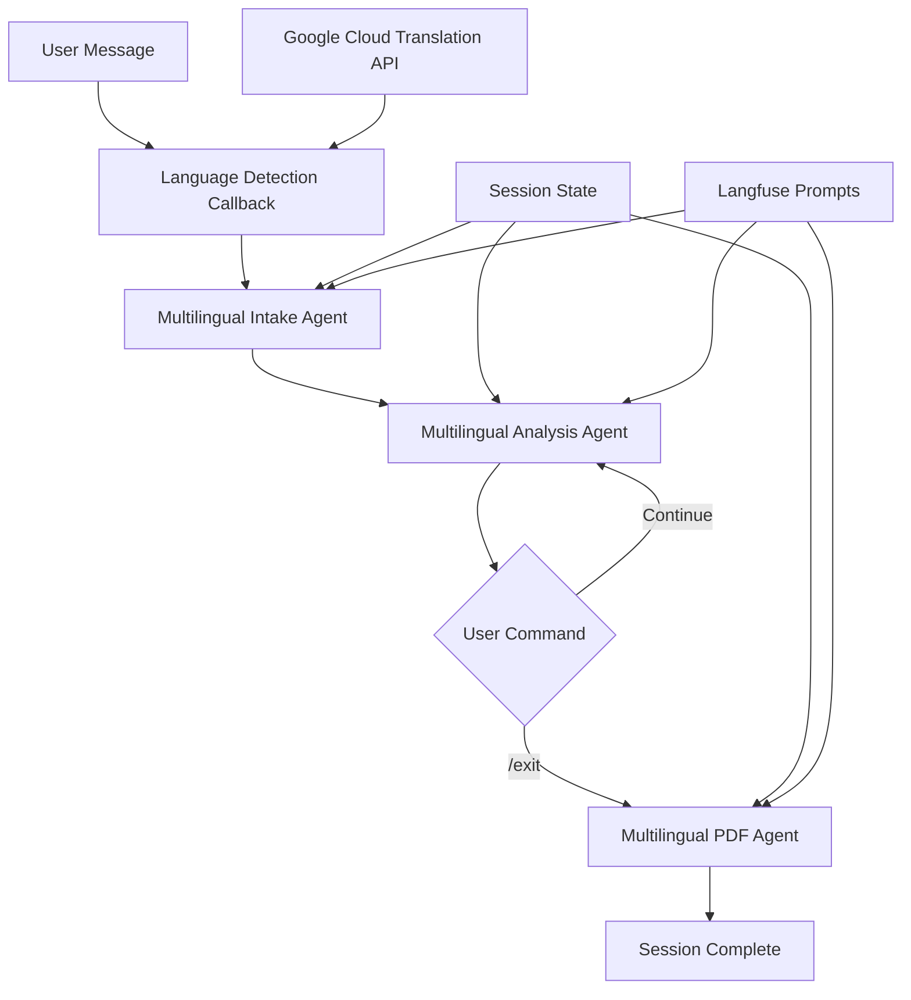

# Multilingual Three-Agent Cognitive Reframing System Design

## Executive Summary

A modular, multilingual cognitive reframing system using three specialized ADK agents that work sequentially to provide culturally-aware mental health support in 100+ languages.

## System Architecture

### Core Components



### Agent Responsibilities

#### 1. Multilingual Intake Agent
**Purpose**: Detect language and collect initial information
- Detects user language via Google Cloud Translation API
- Stores language preference in session state
- Collects: triggering situation, automatic thoughts, emotions
- Validates for crisis indicators in detected language
- Transitions after collecting required data (2-4 turns)

#### 2. Multilingual Analysis Agent  
**Purpose**: Provide CBT analysis with extended conversation support
- Reads language from session state
- Provides initial cognitive distortion analysis
- Informs user about `/exit` command availability
- Supports unlimited follow-up questions
- Deepens therapeutic exploration as needed
- Transitions on `/exit` command or natural conclusion

#### 3. Multilingual PDF Agent
**Purpose**: Generate comprehensive session summary
- Creates PDF in user's detected language
- Includes all collected data and insights
- Formats culturally-appropriate content
- Anonymizes personal information
- Provides downloadable takeaway document

## Technical Implementation

### Language Detection System

```python
# ADK Callback for pre-processing
def language_detection_callback(context: CallbackContext) -> CallbackContext:
    """Detect language before first agent response."""
    if "user_language" not in context.state:
        user_message = context.messages[-1].content
        
        # Try pattern-based detection first (fast)
        language_code, confidence = detect_language_pattern(user_message)
        
        # Use Google API if low confidence
        if confidence < 0.8:
            language_code, confidence = detect_language_google(user_message)
        
        # Store in session state
        context.state["user_language"] = language_code
        context.state["language_name"] = LANGUAGE_NAMES[language_code]
        context.state["language_confidence"] = confidence
    
    return context
```

### Session State Model

```python
from dataclasses import dataclass
from typing import List, Optional
from datetime import datetime

@dataclass
class ConversationTurn:
    timestamp: datetime
    speaker: str  # "user" or "assistant"
    content: str
    phase: str  # "intake", "analysis", "summary"

@dataclass
class IntakeData:
    situation: str
    automatic_thoughts: str
    emotions: str
    emotion_intensity: int

@dataclass
class AnalysisData:
    cognitive_distortions: List[str]
    evidence_for: List[str]
    evidence_against: List[str]
    balanced_thought: str
    micro_action: str
    confidence_before: int
    confidence_after: int

@dataclass
class MultilingualSessionState:
    # Language settings
    user_language: str  # ISO 639-1 code
    language_name: str  # Human-readable name
    language_confidence: float
    
    # Conversation data
    intake_data: Optional[IntakeData]
    analysis_data: Optional[AnalysisData]
    conversation_history: List[ConversationTurn]
    
    # Metadata
    session_id: str
    started_at: datetime
    completed_at: Optional[datetime]
```

### Agent Configuration

```python
# Intake Agent with language detection
class MultilingualIntakeAgent(LlmAgent):
    def __init__(self):
        super().__init__(
            name="multilingual_intake_agent",
            model="gemini-2.0-flash-exp",
            instruction=self._get_dynamic_instruction(),
            tools=[detect_crisis_indicators, validate_intake_data],
            generate_content_config=GenerateContentConfig(
                temperature=0.7,
                max_output_tokens=400,
            ),
            before_agent_callback=language_detection_callback,
        )
    
    def _get_dynamic_instruction(self) -> str:
        """Load instruction template from Langfuse and inject language."""
        base_prompt = prompt_manager.get_prompt("intake-agent-multilingual")
        return base_prompt  # Language injection happens in callback

# Analysis Agent with /exit support
class MultilingualAnalysisAgent(LlmAgent):
    def __init__(self):
        super().__init__(
            name="multilingual_analysis_agent",
            model="gemini-2.0-flash-exp",
            instruction=self._get_dynamic_instruction(),
            tools=[
                identify_cognitive_distortions,
                suggest_balanced_thought,
                check_exit_command,
            ],
            generate_content_config=GenerateContentConfig(
                temperature=0.8,
                max_output_tokens=600,
            ),
        )
    
    def _get_dynamic_instruction(self) -> str:
        base_prompt = prompt_manager.get_prompt("analysis-agent-multilingual")
        # Include /exit command instructions
        return base_prompt + "\n\nIMPORTANT: Tell user they can type /exit anytime to end conversation and receive their summary."
```

### Orchestration with ADK SequentialAgent

```python
class MultilingualReframeOrchestrator:
    def __init__(self):
        # Initialize agents
        self.intake_agent = MultilingualIntakeAgent()
        self.analysis_agent = MultilingualAnalysisAgent()
        self.pdf_agent = MultilingualPDFAgent()
        
        # Create sequential pipeline
        self.pipeline = SequentialAgent(
            name="multilingual_reframing_pipeline",
            sub_agents=[
                self.intake_agent,
                self.analysis_agent,
                self.pdf_agent,
            ],
            description="Multilingual cognitive reframing with extended analysis support",
        )
        
        # Session management
        db_url = os.getenv("SUPABASE_REFRAME_DB_CONNECTION_STRING")
        self.session_service = DatabaseSessionService(db_url)
```

## Language Support Strategy

### Tier 1: Full Native Support
Languages with complete therapeutic translations:
- **Spanish (es)**: Primary user base
- **English (en)**: Secondary default
- **French (fr)**: European coverage
- **German (de)**: DACH region
- **Italian (it)**: Southern Europe
- **Portuguese (pt)**: Brazil/Portugal
- **Catalan (ca)**: Regional support

### Tier 2: Google-Detected Languages
100+ additional languages with:
- Automatic detection via Google API
- English-based therapeutic framework
- Localized crisis resources where available
- Basic cultural adaptations

### Language Detection Flow

```python
def detect_language_with_fallback(text: str) -> dict:
    """Detect language with multi-tier fallback strategy."""
    
    # Tier 1: Pattern-based detection (0ms latency)
    patterns = {
        'es': ['hola', 'estoy', 'tengo', 'problema'],
        'fr': ['bonjour', 'je', 'suis', 'problème'],
        'de': ['hallo', 'ich', 'bin', 'problem'],
        # ... more patterns
    }
    
    detected = match_patterns(text, patterns)
    if detected['confidence'] > 0.8:
        return detected
    
    # Tier 2: Google Cloud Translation API
    try:
        client = translate.Client()
        result = client.detect_language(text)
        return {
            'language_code': result['language'],
            'confidence': result['confidence'],
            'method': 'google_api'
        }
    except Exception as e:
        # Tier 3: Default fallback
        return {
            'language_code': 'es',  # Spanish default
            'confidence': 0.5,
            'method': 'fallback'
        }
```

## Conversation Flow Design

### Phase 1: Intake (2-4 turns)
1. **Turn 1**: Language detection + greeting
2. **Turn 2**: Collect situation
3. **Turn 3**: Identify automatic thoughts
4. **Turn 4**: Assess emotions and intensity

### Phase 2: Analysis (Unlimited with /exit)
1. **Initial Analysis**: 
   - Identify 1-2 cognitive distortions
   - Provide psychoeducation
   - Inform about /exit command
   
2. **Extended Conversation**:
   - Answer follow-up questions
   - Deepen understanding
   - Explore alternative perspectives
   - Continue until /exit or natural end

### Phase 3: Summary (1 turn)
1. Generate comprehensive PDF
2. Include all insights
3. Format in user's language
4. Provide download link

## Exit Command Implementation

### Multilingual Exit Patterns
```python
EXIT_PATTERNS = {
    'es': ['/salir', '/exit', '/terminar'],
    'en': ['/exit', '/quit', '/done'],
    'fr': ['/sortir', '/exit', '/terminer'],
    'de': ['/beenden', '/exit', '/fertig'],
    'it': ['/esci', '/exit', '/fine'],
    'pt': ['/sair', '/exit', '/terminar'],
    'ca': ['/sortir', '/exit', '/acabar'],
    # Universal patterns
    '*': ['/exit', '/quit', '/done', '/end']
}

def check_exit_command(message: str, language: str) -> bool:
    """Check if user wants to exit in any supported language."""
    message_lower = message.lower().strip()
    
    # Check language-specific patterns
    if language in EXIT_PATTERNS:
        for pattern in EXIT_PATTERNS[language]:
            if pattern in message_lower:
                return True
    
    # Check universal patterns
    for pattern in EXIT_PATTERNS['*']:
        if pattern in message_lower:
            return True
    
    return False
```

## Error Handling & Fallbacks

### Language Detection Failures
```python
try:
    language_data = detect_language_google(text)
except GoogleAPIError:
    # Fallback to pattern matching
    language_data = detect_language_pattern(text)
except NetworkError:
    # Default to Spanish (primary user base)
    language_data = {'language_code': 'es', 'confidence': 0.0}
```

### Agent Transition Failures
- Preserve session state in database
- Allow resume from last successful agent
- Provide clear error messages in user's language
- Log errors for monitoring

## Performance Optimizations

### Caching Strategy
- Cache language detection per session
- Store Langfuse prompts locally
- Pre-compile language patterns
- Reuse translation client

### Latency Targets
- Language detection: <200ms (pattern) or <500ms (API)
- Agent transitions: <100ms
- PDF generation: <2s
- Total session: <30s

## Security & Privacy

### Data Handling
- Language preference: Session-only storage
- Google API: No PII in detection requests
- PDF generation: Full anonymization
- Session cleanup: 7-day TTL

### Compliance
- GDPR: Language as non-identifying metadata
- HIPAA: No language-based health inferences
- Regional: Respect data residency requirements

## Testing Strategy

### Unit Tests
```python
def test_language_detection_spanish():
    text = "Hola, me siento muy ansioso"
    result = detect_language_with_fallback(text)
    assert result['language_code'] == 'es'
    assert result['confidence'] > 0.8

def test_exit_command_multilingual():
    assert check_exit_command("/salir", "es") == True
    assert check_exit_command("/exit", "fr") == True
    assert check_exit_command("continue", "en") == False
```

### Integration Tests
- Full conversation flow per language
- Agent transition with state preservation
- PDF generation in each language
- Crisis detection across languages

### User Acceptance Tests
- Native speaker validation
- Cultural appropriateness review
- Therapeutic accuracy check
- Exit command usability

## Deployment Configuration

### Environment Variables
```bash
# Required
GOOGLE_APPLICATION_CREDENTIALS=/path/to/service-account.json
SUPABASE_REFRAME_DB_CONNECTION_STRING=postgresql://...
LANGFUSE_HOST=https://...
LANGFUSE_PUBLIC_KEY=...
LANGFUSE_SECRET_KEY=...

# Optional
DEFAULT_LANGUAGE=es  # Override default fallback
ENABLE_LANGUAGE_DETECTION=true
TRANSLATION_API_TIMEOUT=500  # milliseconds
```

### ADK Configuration
```python
# run_adk.py
from reframe.orchestrators import MultilingualReframeOrchestrator

orchestrator = MultilingualReframeOrchestrator()
runner = Runner(
    agent=orchestrator.pipeline,
    app_name="multilingual_reframe",
    session_service=orchestrator.session_service,
)
```

## Monitoring & Analytics

### Key Metrics
- Language detection accuracy
- Exit command usage rate
- Conversation length by language
- PDF generation success rate

### Alerts
- Language API failures > 5%
- Unknown language rate > 10%
- Session abandonment > 30%
- PDF generation errors > 1%

## Future Enhancements

### Phase 2: Voice Support
- Web Speech API integration
- Real-time transcription
- Text-to-speech responses
- Voice language detection

### Phase 3: Advanced Features
- Multi-language PDFs
- Language switching mid-conversation
- Regional dialect support
- Cultural therapy adaptations

### Phase 4: Scale Optimizations
- Edge language detection
- CDN-cached prompts
- Regional API endpoints
- Batched translations

## Implementation Checklist

- [ ] Set up Google Cloud Translation API
- [ ] Implement language detection callback
- [ ] Create multilingual agents
- [ ] Add /exit command support
- [ ] Test all Tier 1 languages
- [ ] Implement PDF translations
- [ ] Add monitoring/analytics
- [ ] Deploy to production
- [ ] Gather user feedback
- [ ] Iterate on translations

---

*This design prioritizes modularity, maintainability, and user experience while following ADK best practices for multi-agent systems.*