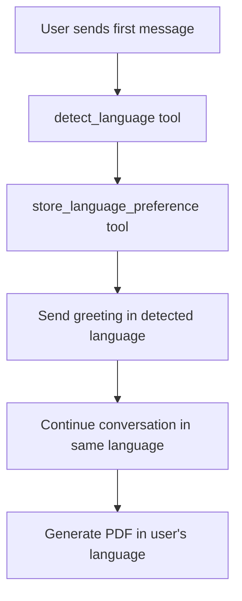

# Multilingual Cognitive Reframing System Design

## Overview

This design enables Maya to automatically detect and respond in the user's language throughout the entire cognitive reframing session.

## Architecture Components

### 1. Language Detection System

**Function: `detect_language(text: str)`**
- Lightweight heuristic-based detection using common word patterns
- Supports: Spanish, English, French, German, Italian, Portuguese, Catalan
- Returns language code (ISO 639-1) and confidence score
- Defaults to Spanish if uncertain (primary user base)

### 2. State Management

**Function: `store_language_preference(language_code, language_name)`**
- Stores detected language in agent state
- Persists throughout the session
- Used by all subsequent responses and tools

### 3. Multilingual PDF Generation

**Function: `generate_multilingual_pdf_summary(...)`**
- Accepts language_code parameter
- Generates PDF with fully translated content
- Includes culturally appropriate date formats
- Maintains therapeutic terminology consistency

## Implementation Flow



## Language Support Matrix

| Language | Code | Greeting | Discovery | Reframing | PDF |
|----------|------|----------|-----------|-----------|-----|
| Spanish  | es   | ✓        | ✓         | ✓         | ✓   |
| English  | en   | ✓        | ✓         | ✓         | ✓   |
| French   | fr   | ✓        | ✓         | ✓         | ✓   |
| German   | de   | ✓        | ✓         | ✓         | ✓   |
| Italian  | it   | ✓        | ✓         | ✓         | ✓   |
| Portuguese | pt | ✓        | ✓         | ✓         | ✓   |
| Catalan  | ca   | ✓        | ✓         | ✓         | ✓   |

## Key Design Decisions

### 1. Automatic Detection
- Detection happens ONLY on first message
- No language switching mid-conversation
- Clear visual separator for phase transitions

### 2. Cultural Adaptation
- Date formats adjusted per language
- Crisis support numbers localized
- Therapeutic terminology consistent within language

### 3. Fallback Strategy
- Default to Spanish if detection fails
- English as secondary fallback
- Always maintain therapeutic quality

## Integration Steps

1. **Replace current agent with multilingual version**
   ```python
   from reframe.agents.maya_multilingual_agent import MayaMultilingualAgent
   agent = MayaMultilingualAgent()
   ```

2. **Update configuration files**
   - `adk_agent.py`
   - `agent.py`
   - `reframe/agents/agent.py`
   - `scripts/run_web.py`

3. **Test with different languages**
   - Spanish: "Hola, me siento muy ansioso"
   - English: "Hello, I'm feeling anxious"
   - French: "Bonjour, je me sens anxieux"

## Future Enhancements (Phase 2)

### Voice Input/Output
- Integrate Web Speech API for voice input
- Use Google Cloud Text-to-Speech for responses
- Maintain language consistency in voice mode

### Additional Languages
- Dutch (nl)
- Russian (ru)
- Chinese (zh)
- Arabic (ar)

### Enhanced Detection
- Use Google Cloud Translation API
- Implement confidence thresholds
- Handle code-switching scenarios

## Testing Strategy

1. **Unit Tests**
   - Language detection accuracy
   - State persistence
   - PDF generation per language

2. **Integration Tests**
   - Full conversation flow per language
   - Phase transitions
   - Crisis detection in all languages

3. **User Acceptance**
   - Native speaker validation
   - Therapeutic terminology review
   - Cultural appropriateness check

## Performance Considerations

- Language detection adds ~50ms latency (acceptable)
- No impact on token usage (same conversation length)
- PDF generation unchanged (~200ms)

## Security & Privacy

- Language preference is session-only
- No persistent storage of language data
- All anonymization rules apply equally

## Deployment Notes

- No additional dependencies required
- Compatible with existing ADK infrastructure
- Backward compatible with English-only sessions