# Therapeutic Session Flow Diagram

## Complete Session Architecture

```mermaid
graph TB
    %% User Interface Layer
    User["👤 User"] -->|"Initial message:<br/>'I can't do anything right'"| CLI["🖥️ ADK CLI Interface"]
    
    %% ADK Runtime Layer
    CLI --> Runner["🏃 ADK Runner<br/>(Session Management)"]
    Runner --> Agent["🤖 Therapeutic Agent<br/>(Single Phase-Aware Agent)"]
    
    %% Agent Decision Layer
    Agent --> PhaseCheck{{"🔍 Phase Check<br/>Have all 3 pieces?"}}
    
    %% Phase 1: Intake Branch
    PhaseCheck -->|"No"| IntakePhase["📝 INTAKE PHASE (AURA)<br/>Acting as empathetic listener"]
    IntakePhase --> GatherInfo["🎯 Gather Information<br/>1. Situation/Trigger<br/>2. Automatic Thought<br/>3. Emotion + Intensity (0-10)"]
    
    %% Phase 2: CBT Branch  
    PhaseCheck -->|"Yes"| CBTPhase["🧠 CBT PHASE<br/>Acting as CBT specialist"]
    CBTPhase --> ApplyCBT["🔧 Apply CBT Techniques<br/>1. Identify distortions<br/>2. Examine evidence<br/>3. Develop balanced thought<br/>4. Suggest micro-action"]
    
    %% Response Flow
    GatherInfo --> Response["💬 Agent Response"]
    ApplyCBT --> Response
    Response --> CLI
    CLI --> User
    
    %% User Continuation
    User -->|"Next message"| CLI
    
    %% Data Storage Layer
    Runner -.->|"Store/Retrieve"| SessionState["📦 Session State<br/>- conversation_history[]<br/>- current_phase<br/>- collected_data{}"]
    
    %% Monitoring Layer
    Agent -.->|"Log events"| Monitor["📊 Monitoring<br/>- Langfuse traces<br/>- OpenTelemetry spans<br/>- Event logs"]

    %% Style definitions
    classDef userStyle fill:#e1f5e1,stroke:#4caf50,stroke-width:3px
    classDef agentStyle fill:#e3f2fd,stroke:#2196f3,stroke-width:3px
    classDef phaseStyle fill:#fff3e0,stroke:#ff9800,stroke-width:2px
    classDef dataStyle fill:#f3e5f5,stroke:#9c27b0,stroke-width:2px
    classDef dangerStyle fill:#ffebee,stroke:#f44336,stroke-width:3px
    
    class User userStyle
    class Agent,IntakePhase,CBTPhase agentStyle
    class SessionState dataStyle
```



## Detailed Session Data Flow


## Session State Storage

```yaml
Session State Structure:
  session_id: "session_12345"
  user_id: "user_anonymous_xyz"
  created_at: "2024-06-24T19:17:00Z"
  
  conversation_history:
    - role: "user"
      content: "I can't do anything right"
      timestamp: "2024-06-24T19:17:00Z"
    - role: "assistant"
      content: "I hear how frustrating..."
      timestamp: "2024-06-24T19:17:05Z"
    # ... more messages
  
  # IntakeData model (from models.py)
  intake_data:
    trigger_situation: "messed up a presentation at work"
    automatic_thought: "I can't do anything right"
    emotion_data: "ashamed and disappointed, 8/10"
    user_inputs: ["I can't do anything right", "messed up...", "Yes", "ashamed..."]
  
  # IntakeAgentOutput flags (from models.py)
  intake_output:
    collection_complete: true
    escalate: false
    crisis_detected: false
    data: <IntakeData>
  
  # ReframeAnalysis model (from models.py) - after CBT phase
  reframe_analysis:
    distortions: ["all-or-nothing thinking", "labeling", "overgeneralization"]
    evidence_for: ["made mistakes in presentation", "felt nervous"]
    evidence_against: ["prepared the content", "showed up", "answered questions"]
    balanced_thought: "I made some mistakes in this presentation, but it doesn't define my overall abilities"
    micro_action: "List 3 things that went well in the presentation (10 min)"
    certainty_before: 85
    certainty_after: 45
    tone: "warm"
  
  # For multi-framework approach (FrameworkAnalysis from models.py)
  framework_analyses:
    - framework: "cbt"
      key_insights: ["Thoughts aren't facts", "Pattern of self-criticism"]
      reframe_suggestions: ["I made mistakes AND I can learn from them"]
      practical_exercises: ["Thought record for 1 week"]
      confidence_score: 0.85
      reasoning: "Clear cognitive distortions present"
    
  # SynthesisResult (from models.py) - if multiple frameworks used
  synthesis_result:
    primary_framework: "cbt"
    unified_reframe: <ReframeAnalysis>
    integrated_insights: ["Self-compassion needed", "Growth mindset helpful"]
    recommended_sequence: ["CBT thought record", "ACT values clarification"]
    coherence_score: 0.92
    conflicts_resolved: []
    
  metadata:
    model_used: "gemini-2.0-flash"
    agent_version: "1.0"
```

## Escalation & Stop Conditions

```mermaid
graph LR
    %% Crisis Detection Flow
    Message["User Message"] --> CrisisCheck{{"🚨 Crisis Keywords?"}}
    CrisisCheck -->|"Yes"| CrisisEscalation["🆘 CRISIS ESCALATION<br/>Provide hotline: 024 (Spain)<br/>Stop normal flow"]
    CrisisCheck -->|"No"| EmotionCheck{{"📈 Emotion Jump?"}}
    
    %% Emotion Escalation
    EmotionCheck -->|">2 point increase"| EmotionEscalation["⚠️ EMOTION ESCALATION<br/>Acknowledge intensity<br/>Offer grounding"]
    EmotionCheck -->|"Normal"| ContinueFlow["✅ Continue Flow"]
    
    %% Session Limits
    ContinueFlow --> TurnCheck{{"🔢 Turn Count?"}}
    TurnCheck -->|">4 intake turns"| ForceTransition["⏭️ FORCE TRANSITION<br/>Move to CBT with<br/>available data"]
    TurnCheck -->|"≤4"| NormalFlow["📋 Normal Flow"]
    
    %% User Exit
    Message --> ExitCheck{{"🚪 User wants exit?"}}
    ExitCheck -->|"'quit', 'exit', 'stop'"| GracefulExit["👋 GRACEFUL EXIT<br/>Save state<br/>Offer return"]
    
    %% Styles
    classDef crisisStyle fill:#ffebee,stroke:#f44336,stroke-width:3px
    classDef warningStyle fill:#fff3e0,stroke:#ff9800,stroke-width:2px
    classDef normalStyle fill:#e8f5e9,stroke:#4caf50,stroke-width:2px
    
    class CrisisEscalation crisisStyle
    class EmotionEscalation,ForceTransition warningStyle
    class ContinueFlow,NormalFlow normalStyle
```



## Component Responsibilities


## Key Decision Points

1. **Phase Transition**
   - Triggered when all 3 data pieces collected
   - Marked by: "Thank you for sharing all of this with me. I have a good understanding now."
   - One-way transition (no return to intake)

2. **Crisis Detection**
   - Keywords: "suicide", "kill myself", "harm myself", etc.
   - Immediate response with hotline (024 in Spain)
   - Overrides all other flows

3. **Emotion Escalation**
   - Triggered by >2 point intensity increase
   - Adds grounding techniques
   - May suggest immediate coping

4. **Session Termination**
   - User commands: "exit", "quit", "stop"
   - Max turn limits exceeded
   - Crisis escalation completed
   - Natural conversation end

5. **Data Persistence**
   - Every user message triggers state save
   - Phase transitions logged
   - Crisis events prioritized
   - 7-day TTL for anonymous sessions