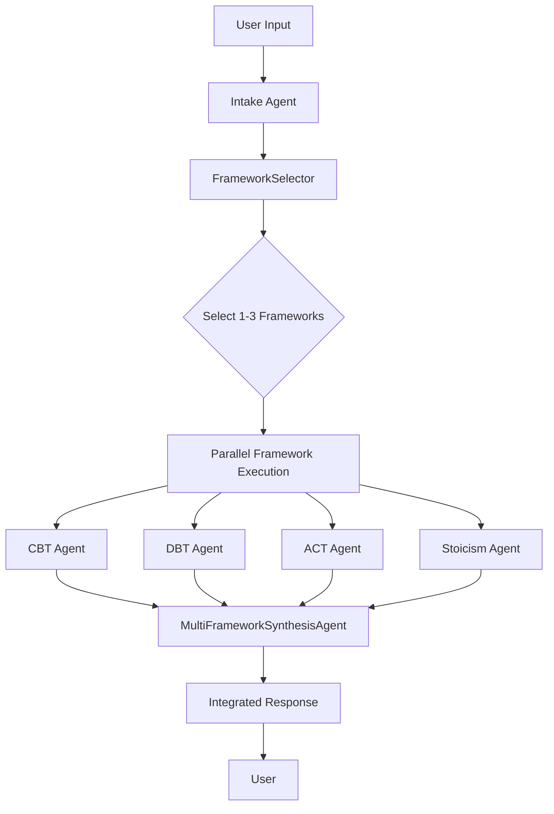

# Framework Integration Design

## Overview

The Framework Integration system enables intelligent selection and synthesis of multiple therapeutic frameworks (CBT, DBT, ACT, Stoicism) based on user input. This document describes the architecture and implementation of the framework integration components.

## Components

### 1. FrameworkSelector

**Purpose**: Intelligently selects 1-3 therapeutic frameworks based on intake data analysis.

**Key Features**:
- Analyzes thought patterns, emotion intensity, and cognitive distortions
- Prioritizes DBT for crisis situations (emotion intensity >= 8)
- Selects complementary frameworks that work well together
- Respects user preferences when available
- Limits selection to maximum 3 frameworks to avoid overwhelming users

**Selection Logic**:
```python
# Crisis situations always get DBT first
if emotion_intensity >= 8 or is_crisis:
    frameworks = ["DBT", ...]
    
# Catastrophizing → CBT
if "catastrophizing" in thought_categories:
    frameworks.append("CBT")
    
# Values/avoidance → ACT  
if "values" in thought_categories or "avoidance" in patterns:
    frameworks.append("ACT")
    
# Control issues → Stoicism
if "control" in thought_categories:
    frameworks.append("Stoicism")
```

### 2. MultiFrameworkSynthesisAgent

**Purpose**: Combines outputs from multiple frameworks into cohesive, non-contradictory guidance.

**Key Features**:
- Synthesizes framework outputs using Gemini 1.5 Flash
- Focuses on "both/and" integration rather than "either/or" conflicts
- Maintains crisis prioritization from DBT
- Preserves framework attribution
- Includes fallback synthesis for error cases

**Output Format**:
```json
{
    "integrated_reframing": "Combined insight from all frameworks",
    "combined_techniques": ["technique1 (CBT)", "technique2 (ACT)"],
    "reasoning_path": ["Step 1", "Step 2", ...],
    "framework_contributions": {
        "CBT": "What CBT contributed",
        "ACT": "What ACT contributed"
    },
    "frameworks_used": ["CBT", "ACT"],
    "synthesis_approach": "integrated"
}
```

### 3. Parallel Framework Processing (Future)

**Purpose**: Execute multiple frameworks concurrently for better performance.

**Design**:
- ADKSessionManager extension for parallel execution
- Respects framework timeout (2s default)
- Handles individual framework failures gracefully
- Crisis situations ensure DBT runs first
- Aggregates results for synthesis

## Integration Flow



## Framework Selection Matrix

| Thought Pattern | Primary Framework | Complementary Framework |
|-----------------|-------------------|-------------------------|
| Crisis/High Distress | DBT | ACT or Stoicism |
| Catastrophizing | CBT | Stoicism |
| Values Conflict | ACT | CBT or DBT |
| Control Issues | Stoicism | ACT |
| Social Anxiety | CBT | ACT |
| Emotional Dysregulation | DBT | ACT |
| All-or-Nothing | CBT | DBT |
| Avoidance | ACT | CBT |

## Testing Strategy

### FrameworkSelector Tests
- Crisis override scenarios
- Complementary framework selection
- User preference handling
- Maximum framework limits
- AvPD-specific patterns

### MultiFrameworkSynthesisAgent Tests
- Multiple framework synthesis
- Single framework handling
- Crisis prioritization preservation
- Conflict resolution
- Empty input handling
- Framework attribution

### Integration Tests (TODO)
- End-to-end flow testing
- Performance benchmarks
- Error propagation
- Session state management

## Performance Considerations

1. **Parallel Execution**: Frameworks should run concurrently with 2s timeout
2. **Caching**: Framework selections can be cached for similar inputs
3. **Resource Limits**: Maximum 3 frameworks per request
4. **Synthesis Optimization**: Use streaming for faster perceived response

## Security & Privacy

1. **No PII Storage**: Framework outputs are ephemeral
2. **Input Validation**: Sanitize intake data before framework processing
3. **Rate Limiting**: Respect 10 req/hour limit across all frameworks
4. **Output Filtering**: Ensure synthesized responses are appropriate

## Future Enhancements

1. **Learning System**: Track framework effectiveness per user
2. **Dynamic Weights**: Adjust selection based on success metrics
3. **Custom Frameworks**: Allow specialized therapeutic approaches
4. **A/B Testing**: Compare framework combinations
5. **Observability**: Detailed metrics on framework performance

## Implementation Status

- [x] FrameworkSelector implementation
- [x] MultiFrameworkSynthesisAgent implementation
- [x] Unit tests with high coverage
- [ ] ADKSessionManager parallel processing
- [ ] Integration with main flow
- [ ] Performance optimization
- [ ] Observability integration
- [ ] Production deployment

## Usage Example

```python
# Select frameworks
selector = FrameworkSelector()
selected_frameworks = await selector.select_frameworks(intake_data, user_context)

# Run frameworks (parallel in future)
framework_outputs = {}
for framework in selected_frameworks:
    agent = get_framework_agent(framework)
    output = await agent.process(intake_data)
    framework_outputs[framework] = output

# Synthesize results
synthesizer = MultiFrameworkSynthesisAgent()
final_response = await synthesizer.synthesize_responses(
    framework_outputs,
    intake_data,
    user_context
)
```