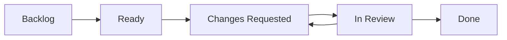

# Team Coordination Guide - CBT Assistant POC

## Table of Contents
1. [Project Overview](#project-overview)
2. [Project Board Access](#project-board-access)
3. [Workflow Methodology](#workflow-methodology)
4. [Git Conventions](#git-conventions)
5. [Pull Request Process](#pull-request-process)
6. [CI/CD Checks](#cicd-checks)
7. [Communication Guidelines](#communication-guidelines)
8. [Quick Reference](#quick-reference)

## Project Overview

We're building a CBT (Cognitive Behavioral Therapy) Assistant as a monorepo with:
- **Frontend**: Next.js 14 (TypeScript) - Currently in `re-frame` repo
- **Backend**: FastAPI with Google ADK (Python) - Currently in `reframe-agents` repo
- **Timeline**: 3.5 weeks for POC completion
- **Total Issues**: 32 across 3 epics

## Project Board Access

### 📋 Main Project Board
**URL**: https://github.com/users/macayaven/projects/7  
**Name**: CBT Assistant POC

### Column Structure
1. **Backlog** (Gray) - Issues not ready to start
2. **Ready** (Blue) - Dependencies met, ready to start
3. **In Progress** (Yellow) - Active development (max 1 per person)
4. **In Review** (Purple) - PR created and under review
5. **Done** (Green) - PR merged to main

### How to Update Issue Status
1. **Drag and drop** issues between columns on the board
2. **Or** use issue comments:
   - `/project "CBT Assistant POC" status:"In Progress"`
   - `/project "CBT Assistant POC" status:"In Review"`

## Workflow Methodology

### 1. Epic Flow
```
Epic 0 (Migration) → Epic 1 (Local Docker) → Testing Gate → Epic 2 (Cloud Run)
```

**IMPORTANT**: 
- Complete Epic 0 before starting Epic 1
- Complete and test Epic 1 locally before starting Epic 2
- No skipping ahead!

### 2. Issue Lifecycle



### 3. Daily Workflow

1. **Morning Sync** (15 min)
   - Check project board
   - Update issue status
   - Identify blockers

2. **Development**
   - Pick ONE issue from "Ready"
   - Move to "In Progress"
   - Create feature branch
   - Implement solution

3. **End of Day**
   - Push code to branch
   - Update issue comments
   - Move blocked items back to "Ready"

## Git Conventions

### Branch Naming
```
<type>/<epic>-<issue>-<brief-description>

Examples:
feat/epic-0-135-prepare-repo-structure
fix/epic-1-142-audio-conversion-bug
docs/epic-s1-164-integration-docs
```

**Types**:
- `feat` - New feature
- `fix` - Bug fix
- `docs` - Documentation
- `test` - Testing
- `refactor` - Code refactoring
- `ci` - CI/CD changes

### Commit Messages
```
[<Epic>-<Issue>] <type>: <brief description>

<detailed description if needed>

Examples:
[Epic-0.1] feat: restructure repository for monorepo
[Epic-1.3] fix: handle 48kHz to 16kHz audio conversion
[Epic-S1] docs: add API contract documentation
```

### Working with Monorepo

After Epic 0 completion, the structure will be:
```
re-frame/
├── backend/     # Python backend code
├── frontend/    # Next.js frontend code
├── docs/        # Shared documentation
└── scripts/     # Shared scripts
```

**Important**: Always run commands from the appropriate directory!

## Pull Request Process

### 1. Creating a PR

**Title Format**:
```
[Epic-X.Y] Brief description of changes
```

**PR Template**:
```markdown
## Summary
Brief description of what this PR accomplishes

## Related Issue
Closes #<issue-number>

## Type of Change
- [ ] Bug fix
- [ ] New feature
- [ ] Documentation update
- [ ] Performance improvement

## Testing
- [ ] Local tests pass
- [ ] Added/updated tests
- [ ] Tested with frontend/backend integration

## Checklist
- [ ] Code follows project conventions
- [ ] Self-review completed
- [ ] Comments added for complex logic
- [ ] Documentation updated if needed
```

### 2. Review Process

1. **Self Review First**
   - Check your own PR
   - Ensure all checks pass
   - Test locally

2. **Request Review**
   - Frontend PRs: Request from frontend team lead
   - Backend PRs: Request from backend team lead
   - Shared PRs: Request from both teams

3. **Address Feedback**
   - Respond to all comments
   - Push fixes as new commits
   - Re-request review when ready

### 3. Merging Rules

- ✅ All CI checks must pass
- ✅ At least 1 approval required
- ✅ No unresolved conversations
- ✅ Up to date with main branch
- ✅ Linked issue moves to "Done" automatically

## CI/CD Checks

### Current Checks (Pre-Migration)

**Frontend (re-frame)**:
```yaml
- Next.js build
- TypeScript compilation
- ESLint
- Jest tests
- Lighthouse CI (performance)
```

**Backend (reframe-agents)**:
```yaml
- Python linting (ruff)
- Type checking (mypy)
- Unit tests (pytest)
- Security scan
```

### Post-Migration Checks (Monorepo)

We need to implement:

```yaml
# .github/workflows/ci.yml
name: CI

on:
  pull_request:
    branches: [main]

jobs:
  # Detect changed files
  changes:
    runs-on: ubuntu-latest
    outputs:
      frontend: ${{ steps.filter.outputs.frontend }}
      backend: ${{ steps.filter.outputs.backend }}
    steps:
      - uses: dorny/paths-filter@v2
        id: filter
        with:
          filters: |
            frontend:
              - 'frontend/**'
            backend:
              - 'backend/**'

  # Frontend checks
  frontend:
    needs: changes
    if: ${{ needs.changes.outputs.frontend == 'true' }}
    runs-on: ubuntu-latest
    steps:
      - uses: actions/checkout@v3
      - name: Frontend Tests
        run: |
          cd frontend
          npm ci
          npm run lint
          npm run type-check
          npm run test
          npm run build

  # Backend checks
  backend:
    needs: changes
    if: ${{ needs.changes.outputs.backend == 'true' }}
    runs-on: ubuntu-latest
    steps:
      - uses: actions/checkout@v3
      - name: Backend Tests
        run: |
          cd backend
          pip install uv
          uv sync
          uv run ruff check
          uv run mypy src
          uv run pytest

  # Integration tests (always run)
  integration:
    runs-on: ubuntu-latest
    steps:
      - uses: actions/checkout@v3
      - name: Integration Tests
        run: |
          docker-compose up -d
          npm run test:e2e
          docker-compose down
```

### Required Checks Per Epic

**Epic 0 (Migration)**:
- Basic file structure validation
- Git history preserved
- README updated

**Epic 1 (Local Docker)**:
- Docker build succeeds
- docker-compose up works
- Basic integration test passes

**Epic 2 (Cloud Run)**:
- Production build succeeds
- Security scan passes
- Performance benchmarks met

## Communication Guidelines

### 1. GitHub Issues
- **Updates**: Comment on issues daily with progress
- **Blockers**: Tag relevant team members
- **Questions**: Use issue comments, not Slack/Discord

### 2. GitHub Discussions
**Enable GitHub Discussions** in repo Settings → Features → Discussions

**Categories to create**:
- **📢 Announcements** - Project updates and decisions
- **💬 General** - General project discussion  
- **🎯 Daily Standups** - Daily progress updates
- **🚨 Blockers** - Urgent issues that need attention
- **💡 Ideas** - Feature suggestions and improvements
- **📚 Resources** - Useful links and documentation
- **🎉 Show and Tell** - Demo completed features

**How to use**:
- **Daily Standups**: Create a new discussion each week titled "Week of [Date] - Daily Standups"
- **Blockers**: Create immediately when blocked, tag relevant team members with @mentions
- **Decisions**: Document in Announcements, then update relevant docs
- **Questions**: Post in General, tag people who can help

### 3. Meetings
- **Daily Standup**: 9:00 AM (15 min)
- **Weekly Demo**: Fridays 3:00 PM
- **Retrospective**: End of each epic

### 4. Documentation
- Update docs as you code
- Document decisions in ADRs (Architecture Decision Records)
- Keep README files current

## Quick Reference

### Essential Commands

```bash
# After Epic 0 - Monorepo structure
cd re-frame

# Frontend development
cd frontend
npm install
npm run dev

# Backend development
cd backend
uv sync
uv run python src/main.py

# Full stack
docker-compose up

# Run all tests
./scripts/test-all.sh
```

### Issue Label Reference

**Epic Labels**:
- `epic-0-migration` - Monorepo migration
- `epic-1-local` - Local Docker deployment
- `epic-2-production` - Cloud Run deployment

**Team Labels**:
- `team-frontend` - Frontend team
- `team-backend` - Backend team
- `team-shared` - Both teams
- `team-devops` - DevOps tasks

**Priority Labels**:
- `priority-P0` - Critical (blockers)
- `priority-P1` - High priority
- `priority-P2` - Medium priority

**Size Labels**:
- `size-1` - 1 story point (~2-4 hours)
- `size-2` - 2 story points (~4-8 hours)
- `size-3` - 3 story points (~1-2 days)
- `size-5` - 5 story points (~2-3 days)

### Key Links

- **Repository**: https://github.com/macayaven/re-frame
- **Project Board**: https://github.com/users/macayaven/projects/7
- **Issues List**: https://github.com/macayaven/re-frame/issues
- **Milestones**: https://github.com/macayaven/re-frame/milestones
- **Wiki**: https://github.com/macayaven/re-frame/wiki

### Emergency Contacts

- **Frontend Lead**: @frontend-lead
- **Backend Lead**: @backend-lead
- **DevOps**: @devops-lead
- **Project Manager**: @pm

## Getting Started Checklist

- [ ] Access project board
- [ ] Review your assigned issues
- [ ] Set up development environment
- [ ] Check GitHub Discussions is enabled
- [ ] Read this guide completely
- [ ] Attend first daily standup

## Definition of Done

An issue is considered "Done" when:
- [ ] Code is complete and tested
- [ ] PR is merged to main
- [ ] Documentation is updated
- [ ] Issue is closed
- [ ] Related issues are updated

---

**Remember**: Communication is key! When in doubt, ask questions in the issue comments or team channels.

**Let's build something amazing together! 🚀**