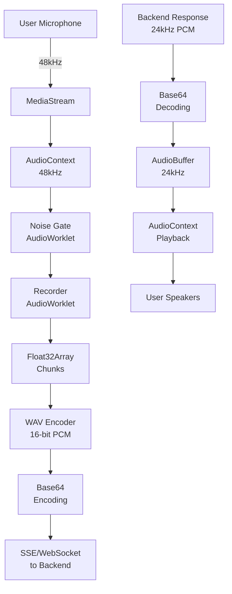

# Audio Format Specification

This document describes the audio recording, processing, and transmission formats used in re-frame.social.

## Table of Contents

- [Recording Format](#recording-format)
- [Transmission Format](#transmission-format)
- [Playback Format](#playback-format)
- [Audio Flow Diagram](#audio-flow-diagram)
- [Browser Compatibility](#browser-compatibility)
- [Debugging](#debugging)
- [Known Issues](#known-issues)

## Recording Format

The frontend records audio using the Web Audio API with the following specifications:

### Primary Recording Format (WAV)
- **Sample Rate**: 48,000 Hz (48kHz)
- **Bit Depth**: 16-bit PCM
- **Channels**: 1 (Mono)
- **Format**: WAV (RIFF WAVE)
- **MIME Type**: `audio/wav`

### Audio Processing Pipeline
1. **Input**: Browser MediaStream at 48kHz
2. **Noise Gate**: AudioWorklet processor for voice activity detection
3. **Recording**: AudioWorklet processor capturing Float32Array chunks
4. **Output**: WAV file with 16-bit PCM encoding

### Configuration
```javascript
// Default recording configuration
const audioContext = new AudioContext({
  sampleRate: 48000  // 48kHz sampling rate
})

// Media constraints
const constraints = {
  audio: {
    channelCount: 1,
    echoCancellation: true,
    noiseSuppression: true,
    autoGainControl: true
  }
}
```

## Transmission Format

### To Backend
When sending audio to the backend, the frontend converts the recorded WAV to base64:

```javascript
// Audio message format
{
  "data": "base64_encoded_wav_data",
  "mimeType": "audio/wav",
  "messageType": "thought",
  "sessionId": "session_123",
  "turnComplete": false
}
```

### From Backend
The backend sends audio responses as base64-encoded PCM:

```javascript
// Backend audio response
{
  "message_type": "audio",
  "data": "base64_encoded_pcm_data",
  "mimeType": "audio/pcm",
  "sampleRate": 24000,  // 24kHz for TTS playback
  "channels": 1
}
```

## Playback Format

### TTS Playback Configuration
- **Sample Rate**: 24,000 Hz (24kHz)
- **Format**: Raw PCM (no WAV header)
- **Channels**: 1 (Mono)
- **Buffer Size**: 180 seconds ring buffer

### Playback Pipeline
1. Receive base64-encoded PCM from backend
2. Decode to Float32Array
3. Create AudioBuffer at 24kHz
4. Play through Web Audio API

## Audio Flow Diagram



## Browser Compatibility

### Supported Browsers
| Browser | Minimum Version | Notes |
|---------|----------------|-------|
| Chrome | 66+ | Full AudioWorklet support |
| Edge | 79+ | Chromium-based versions |
| Firefox | 76+ | AudioWorklet support |
| Safari | 14.1+ | iOS 14.5+ required |

### Required APIs
- Web Audio API
- AudioWorklet API
- MediaDevices API
- MediaStream API

### Feature Detection
```javascript
const isSupported = () => {
  return 'AudioContext' in window &&
         'AudioWorklet' in window &&
         'mediaDevices' in navigator &&
         'getUserMedia' in navigator.mediaDevices
}
```

## Debugging

### Audio Debug Utilities

#### 1. Check Audio Context State
```javascript
// Log audio context state
console.log('AudioContext state:', audioContext.state)
console.log('Sample rate:', audioContext.sampleRate)
console.log('Output latency:', audioContext.outputLatency)
```

#### 2. Monitor Recording Levels
```javascript
// Create analyzer node for debugging
const analyser = audioContext.createAnalyser()
source.connect(analyser)

// Get audio levels
const dataArray = new Uint8Array(analyser.frequencyBinCount)
analyser.getByteFrequencyData(dataArray)
const avgLevel = dataArray.reduce((a, b) => a + b) / dataArray.length
console.log('Audio level:', avgLevel)
```

#### 3. Save Recording for Analysis
```javascript
// Debug: Save recording to file
const debugSaveRecording = (blob) => {
  const url = URL.createObjectURL(blob)
  const a = document.createElement('a')
  a.href = url
  a.download = `recording-${Date.now()}.wav`
  a.click()
}
```

### Common Issues and Solutions

#### Issue: No Audio Input
```javascript
// Check microphone permissions
navigator.permissions.query({ name: 'microphone' })
  .then(result => console.log('Mic permission:', result.state))

// List available devices
navigator.mediaDevices.enumerateDevices()
  .then(devices => {
    const mics = devices.filter(d => d.kind === 'audioinput')
    console.log('Available microphones:', mics)
  })
```

#### Issue: Audio Context Suspended
```javascript
// Resume suspended context
if (audioContext.state === 'suspended') {
  await audioContext.resume()
}
```

#### Issue: Worklet Loading Failures
```javascript
// Debug worklet loading
try {
  await audioContext.audioWorklet.addModule('/worklets/processor.js')
} catch (error) {
  console.error('Worklet loading failed:', error)
  // Check: Is the file accessible?
  // Check: Is the worklet code valid?
  // Check: Are there CORS issues?
}
```

## Known Issues

### 1. Safari AudioWorklet Limitations
- Safari may have issues with AudioWorklet in some versions
- Fallback: Use ScriptProcessorNode (deprecated but functional)

### 2. Mobile Browser Constraints
- iOS requires user interaction to start AudioContext
- Android Chrome may have different default sample rates
- Mobile browsers may apply aggressive audio processing

### 3. Sample Rate Mismatches
- Some devices may not support 48kHz natively
- AudioContext will resample automatically but may introduce latency
- Monitor actual sample rate: `audioContext.sampleRate`

### 4. Memory Management
- Long recordings can consume significant memory
- Implement chunked upload for recordings > 1 minute
- Clear audio buffers after processing

## Troubleshooting Guide

### Step 1: Verify Browser Support
```javascript
if (!isSupported()) {
  console.error('Browser does not support required audio APIs')
  // Show user-friendly error message
}
```

### Step 2: Check Permissions
```javascript
try {
  const stream = await navigator.mediaDevices.getUserMedia({ audio: true })
  console.log('Microphone access granted')
  stream.getTracks().forEach(track => track.stop())
} catch (error) {
  console.error('Microphone access denied:', error)
}
```

### Step 3: Test Audio Pipeline
```javascript
// Test recording -> playback pipeline
const testAudioPipeline = async () => {
  const recorder = new AudioRecorder()
  await recorder.initialize()
  
  // Record 2 seconds
  await recorder.start()
  await new Promise(resolve => setTimeout(resolve, 2000))
  const blob = await recorder.stop()
  
  // Play back recording
  const audio = new Audio(URL.createObjectURL(blob))
  await audio.play()
  
  recorder.cleanup()
}
```

### Step 4: Monitor Network
- Check SSE connection for audio messages
- Verify base64 encoding/decoding
- Monitor message sizes and timing

## Performance Considerations

### Memory Usage
- Each second of 48kHz mono audio = ~96KB raw
- WAV encoding adds 44-byte header
- Base64 encoding increases size by ~33%

### Latency Sources
1. **Input Latency**: ~10-20ms (hardware dependent)
2. **Processing Latency**: ~10-30ms (noise gate + recording)
3. **Network Latency**: Variable (depends on connection)
4. **Playback Latency**: ~20-50ms (buffering)

### Optimization Tips
- Use smaller buffer sizes for lower latency
- Implement audio compression for large files
- Stream audio chunks instead of waiting for complete recording
- Pre-load AudioWorklet modules during app initialization